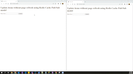

# The Sync Service
Allows you to keep data consistent throughhout your application

Example Use Case:
User adds items from bowser instance one, it will be reflected on browser instance 2  without page refresh.

# Requirements
- Redis-cache
- Ensure Web Browser supports Server-Sent Events

# Sample Output
- 
- Video is [here](Output/SyncItems.mp4)

# Steps To Run
- Download [Redis Cache](https://redis.io/download/), preferably run on the [docker container](https://redis.io/download/#docker)
- Run following commands
    ```
        pip install virtualenv;
        virtualenv venv;
    ```
- Activate Virtual Env
    ```
        venv\Scripts\activate.ps1
    ```
- Install all requests
    ```
        pip install -r requirements.txt
    ```    

- Run the projects (Powershell) . Refer [here](https://flask.palletsprojects.com/en/2.1.x/quickstart/)
    ```
        $env:FLASK_APP = "server"
        flask run 
    ```    